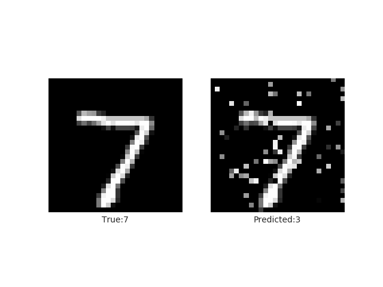
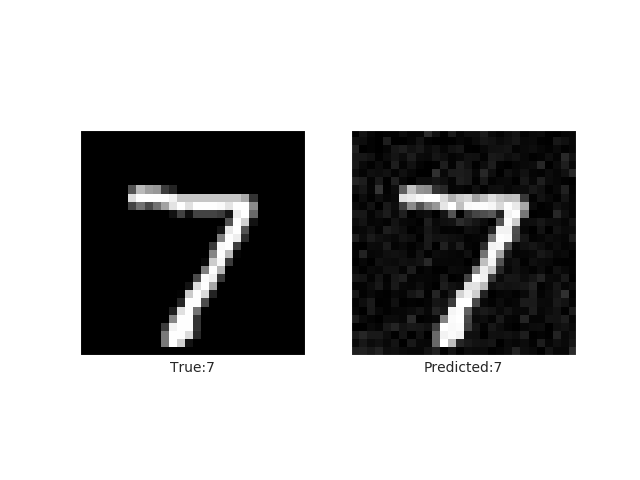
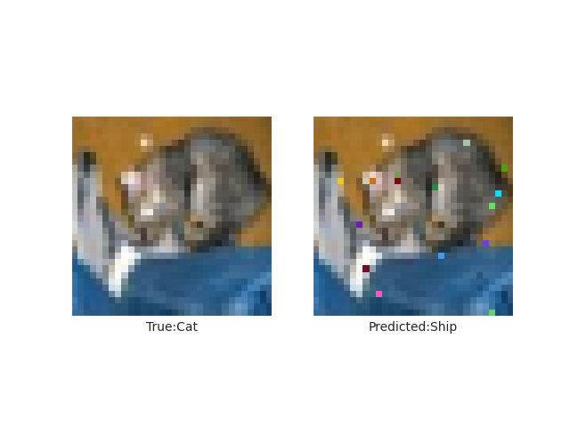
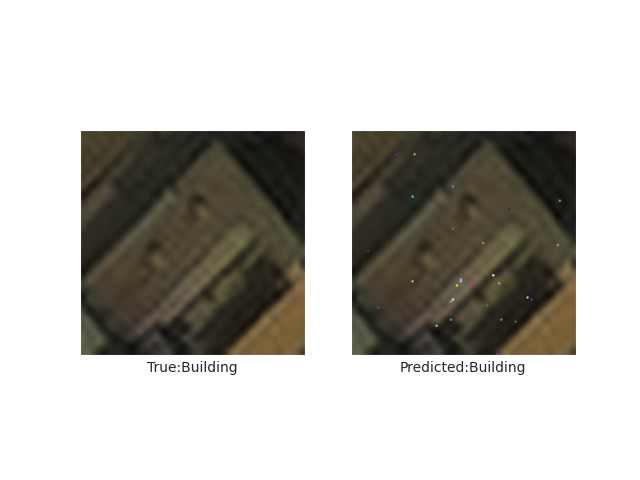
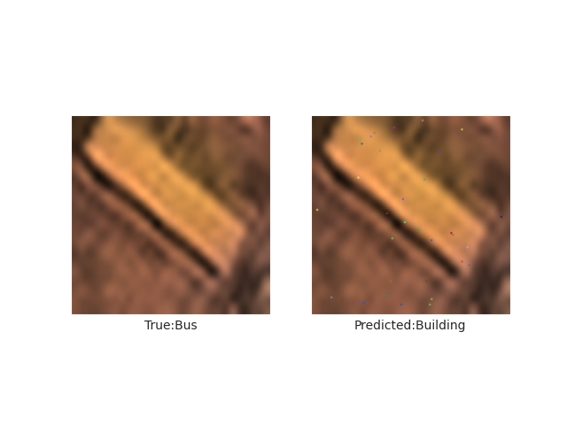
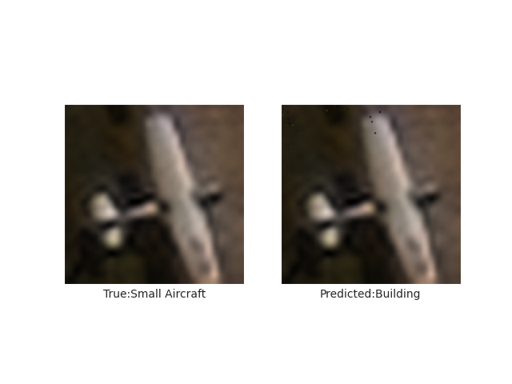
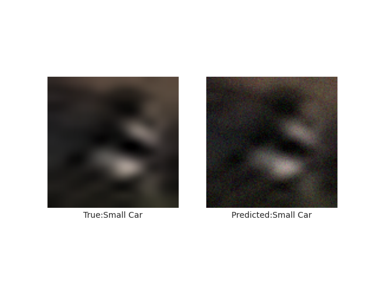

# Pixel and Threshold Attack on Xview Dataset

This GitHub repository contains the official code for the papers,

> [Adversarial robustness assessment: Why in evaluation both L0 and L∞ attacks are necessary](https://journals.plos.org/plosone/article?id=10.1371/journal.pone.0265723)\
> Shashank Kotyan and Danilo Vasconcellos Vargas, \
> PLOS One (2022).

> [One pixel attack for fooling deep neural networks](https://ieeexplore.ieee.org/abstract/document/8601309)\
> Jiawei Su, Danilo Vasconcellos Vargas, Kouichi Sakurai\
> IEEE Transactions on Evolutionary Computation (2019).
 
## Citation

If this work helps your research and/or project in anyway, please cite:

```bibtex
@article{kotyan2022adversarial,
  title={Adversarial robustness assessment: Why in evaluation both L 0 and L∞ attacks are necessary},
  author={Kotyan, Shashank and Vargas, Danilo Vasconcellos},
  journal={PloS one},
  volume={17},
  number={4},
  pages={e0265723},
  year={2022},
  publisher={Public Library of Science San Francisco, CA USA}
}

@article{su2019one,
  title     = {One pixel attack for fooling deep neural networks},
  author    = {Su, Jiawei and Vargas, Danilo Vasconcellos and Sakurai, Kouichi},
  journal   = {IEEE Transactions on Evolutionary Computation},
  volume    = {23},
  number    = {5},
  pages     = {828--841},
  year      = {2019},
  publisher = {IEEE}
}
```

Additionally it contains the work on the Xview dataset and YoloV3 network as well.

## Environment Setup

Ensure that you have a system with a GPU to do the training, if you already have the model weights, then its not needed.

First clone this repository in your local system.
```bash
git clone <This repo link>
```

To install the required packages, use the XviewAttackenv.yml file
```bash
conda create -f XviewAttackenv.yml
conda activate dqa
```

Link of YoloV3 tensorflow model repo used: [YoloV3 Architecture](https://github.com/zzh8829/yolov3-tf2/blob/master/train.py)

## Dataset Installation

We ran the attacks on the Xview dataset, it can be installed from the Xview dataset challenge page : [Xview Dataset](http://xviewdataset.org/#dataset)

Or it can download the formatted dataset we have used from this link: [Xview Formatted Dataset](https://drive.google.com/drive/folders/1P0fL3wWNJkjwfq5NBYRjw-KzPx4FYEBl?usp=sharing)

### File Structure

The folders are expected to look like: 

```bash
datasets
|__images
    |__train
        |__1.tiff
        |__2.tiff
    |__val
        |__1.tiff
        |__2.tiff
    |__autosplit_train.txt
    |__autosplit_val.txt
|__labels
    |__train
        |__1.txt
```

## Downloading Weights and Results

The results of our experiments, which involve the affects of the attack and the model weights can be found in this link: [Results and Weights](https://drive.google.com/drive/folders/1Ctlv4lhhjTADT0bnHnX4iv7jNUeyqkx7?usp=sharing)

# Work Summary

## Initial Setup

We began by setting up the existing codebase for dual quality assessment and familiarizing ourselves with its functionality. This involved:

- Installing the required TensorFlow version.
- Downloading and preparing the Xview dataset.
- Running the `run_unit_tests.sh` script, which executes pixel and threshold attacks on LeNet and MLP model architectures.

## Motivation for Extension

Our objective was to adapt and run these attacks on the **Xview** dataset, as it is more relevant for testing the robustness of models on aerial imagery. However, during our experiments, we observed two key limitations:

1. **Attack Objective**: The existing attack code is designed to induce **misclassification**, not **misplacement or removal** of bounding boxes.
2. **Data Loading Inefficiency**: Data loaders for other datasets load the entire data into NumPy arrays, which is inefficient for large-scale datasets like Xview.

## Improvements Made

### 1. TensorFlow Dataset Integration

To address the inefficiencies and enable on-the-fly data processing, we integrated **TensorFlow Datasets** (TFDS) and **Keras** preprocessing. This allowed image loading and preprocessing to happen during runtime, significantly improving efficiency.

- Updated the data loader to crop each bounding box and assign the appropriate class label.
- This was necessary since the system supports **single-object classification**, while Xview contains **multiple bounding boxes per image**.
- The code in `oldmodel.py` can still be used for legacy NumPy-based data loading.

### 2. Model Code Updates

The `code/networks/model.py` file had several functions that assumed NumPy-based inputs. These were refactored to support TensorFlow Datasets, ensuring compatibility with the new data pipeline.

### 3. Network Architecture

Although the attack method is **black-box**, the model architecture needs to be defined in TensorFlow to allow forward propagation with and without noise.

We focused on the **YOLOv3** model architecture due to its relevance in aerial object detection tasks, especially since it is being tested in the ADA Lab.

- We implemented YOLOv3 by adapting from a TensorFlow-based YOLOv3 implementation.
- The original object detection head (bounding box regressor) was removed.
- It was replaced with a simple **classifier ANN** using the YOLOv3 backbone as a feature extractor.

### 4. Running the Attack

With the model and dataloader configured, we were able to prepare the system to run attacks on the Xview dataset using the YOLOv3-based classifier.

- New configurations were added to `code/attacks/base_attack.py`.
- Existing scripts were modified to support and execute attacks using the updated setup.


## General Steps to Run Code on Other Datasets

First create a new folder inside the code folder with the name of the dataset.

Then create the ``__init__.py`` file which has the imports for all the files that will be defined in this module

Then the dataloader file needs to be defined, which will inherit the ``Model`` class from the model.py file and implement the necessary functions

Finally the network file needs to be created which inherits the dataloader file created earlier and specifies the network and usage code.

## Some results of the Attacks

### Pixel Attack Results:

**MNIST Dataset**





**Cifar Dataset**




**Xview Dataset and Yolo Model**









## Future Work

This work shows the power of the black box attacks on the object classification task, which is more or less model architecture agnostic. Future work can focus on utilizing these attacks for modifying bounding box results since exisitng methods like patch attack is still white box where the patch generation is dependent on the training of the model to generate an effective patch.

